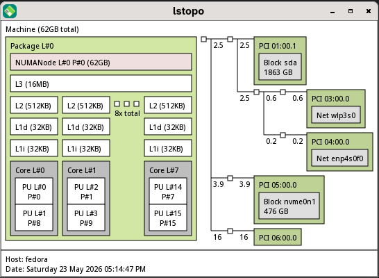

# Architectural Mapping and Language-Agnostic `hwloc` Concepts

When developing high-performance parallel applications, cross-platform libraries like `hwloc` abstract complex hardware layers into a consistent, language-agnostic hierarchical tree.

---

## Hardware Structural Comparison

| Architectural Feature | System 1: Ryzen 7 5700G Desktop | System 2: Dual-Socket Enterprise Server |
| --- | --- | --- |
| **Total Physical Sockets** | 1 (`HWLOC_OBJ_PACKAGE`) | 2 (`HWLOC_OBJ_PACKAGE`) |
| **Total System RAM** | 62 GB | 383 GB |
| **Memory Topology** | Uniform Memory Access (UMA) | Non-Uniform Memory Access (NUMA) |
| **Total Physical Cores** | 8 (`HWLOC_OBJ_CORE`) | 32 (16 per package) |
| **Total Logical Threads** | 16 (SMT Enabled) | 32 (SMT Disabled / 1 PU per Core) |
| **L2 Cache Allocation** | 512 KB per core | 1024 KB (1 MB) per core |
| **L3 Cache Allocation** | 16 MB shared (monolithic) | 44 MB total (22 MB shared per package) |
| **Co-Processors / OpenCL** | Integrated Radeon (No discrete node) | NVIDIA Accelerator via OpenCL / CUDA Component |

---

## Conceptual Mechanics of the `hwloc` Tree

Regardless of whether you interface with hardware via C, C++, Python, or Rust bindings, `hwloc` parses a system into a unified tree structure composed of **Objects**, **Cpusets**, and **Nodesets**.

### 1. Object Types (`hwloc_obj_t`)

The library maps hardware components into structural types. In the topologies provided:

* **`HWLOC_OBJ_MACHINE`**: The global root representing the entire host.
* **`HWLOC_OBJ_NUMANODE`**: A physical chunk of memory. System 1 has exactly one global node. System 2 contains two separate nodes split across the interconnect.
* **`HWLOC_OBJ_PACKAGE`**: The physical silicon socket housing execution engines.
* **`HWLOC_OBJ_CACHE`**: Memory boundaries representing L1i, L1d, L2, and L3 caches.
* **`HWLOC_OBJ_CORE`**: The physical compute core.
* **`HWLOC_OBJ_PU`**: The logical Processing Unit (thread) visible to the OS Scheduler.

### 2. Bitmasks: Cpusets vs. Nodesets

To target execution and memory boundaries, `hwloc` uses bitmap concepts:

* **Cpuset**: A bitmap representing logical processors (`PU`). For example, on the Ryzen desktop, the cpuset of `Core L#0` contains the bits representing both `PU L#0` and `PU L#8`.
* **Nodeset**: A bitmap representing proximity to physical memory pools (`NUMANode`). On System 1, the nodeset for any core points to the single memory bank. On System 2, `Core L#0` and `Core L#16` point to completely separate nodesets.

---

## Language-Agnostic Architectural Analysis & Optimization

### System 1: Consumer Desktop (AMD Ryzen 7 5700G)

#### Topology Quirks

* **Monolithic L3 Cache Traversal**: All 8 physical cores fully share the 16 MB L3 cache pool. Inter-thread communication latency across different cores is highly uniform. Developers do not need to segment thread pools into sub-clusters (CCX) as was required in older generations of Zen architectures.
* **SMT Topology Overlap**: Because Simultaneous Multithreading is active, each `Core` object contains two `PU` objects. For arithmetic, matrix-heavy compute tasks, programmatic thread pools should isolate execution to either even or odd `PU` indices. Placing two heavy compute threads on the same physical core results in execution-unit starvation.

---

### System 2: Enterprise Server / HPC Workstation

#### Topology Quirks

* **The Interconnect Intercept**: Memory is physically partitioned into `NUMANode L#0` and `NUMANode L#1`. If an execution thread on `Package L#0` accesses variables residing in `NUMANode L#1`, data packets must cross the physical socket interconnect. This increases memory retrieval latency and causes bus contention.
* **SMT-Disabled Core Cleanliness**: Each physical core maps to exactly one logical processing unit. Parallel resource distribution algorithms do not need to account for logical execution-unit sharing.
* **Asymmetric I/O Layout**: High-speed storage (`nvme0n1`) and clustering fabric (`ib0`) are wired directly to `Package L#0`, while the NVIDIA hardware accelerator (`cuda1`) is wired to `Package L#1`.

---

## Design Patterns for High Performance Applications

When writing code to target asymmetric systems like System 2, your application architecture should follow three core structural patterns:

### Pattern A: GPU-Compute Affinity

When spawning threads designed to coordinate work with the NVIDIA accelerator card, your scheduling logic must prioritize hardware proximity:

1. **Discover Core Grouping:** Query the system to isolate the `Package` object that structurally contains the accelerator peripheral (in this case, Package 1).
2. **Execution Affinity:** Restrict the worker threads' CPU execution mask (`cpuset`) specifically to the cores found inside Package 1 (Cores 16–31).
3. **Allocation Affinity:** Enforce a strict memory allocation policy (`nodeset`) targeting `NUMANode L#1`. This ensures that data structures mirrored to or from the GPU sit in the RAM sticks physically wired to that exact socket.

### Pattern B: Isolated Storage & Ingress Pipelines

If a component of your application is purely I/O bound (e.g., streaming massive data blocks from the InfiniBand card `ib0` or writing checkpoints to `nvme0n1`), executing those routines on the GPU-side package introduces severe performance degradation.

1. **Isolate the Core Pools:** Programmatically split your internal thread worker pools into an *I/O Pool* and a *Compute Pool*.
2. **Bind I/O Pipelines:** Pin the I/O Pool to the `cpuset` of Package 0.
3. **Byproduct:** Data travels directly from the network/storage fabric into `NUMANode L#0` without crossing the cross-socket bus, leaving Package 1 completely isolated for math intensive acceleration.

### Pattern C: Topology-Driven "First-Touch" Memory Allocation

By default, standard memory allocation allocations are deferred until a memory address is modified. To prevent allocation cross-contamination across NUMA boundaries:

1. **Bind Before Write:** Ensure a thread sets its local execution affinity to a specific `Core` or `Package` *before* it initializes or populates arrays.
2. **Local Guarantee:** Operating systems typically utilize a "First-Touch" policy, meaning memory blocks are allocated on the physical NUMA node closest to the thread modifying the data. Programmatically managing thread affinity prior to data initialization guarantees local data alignment.