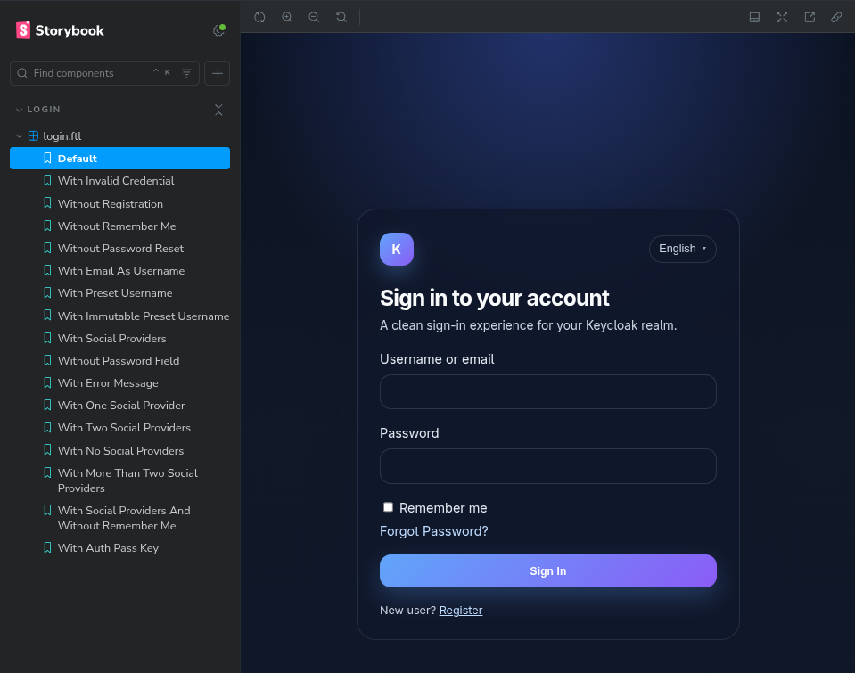

# Local Keycloak Development Environment

This project spins up a local instance of Keycloak using Podman and provisions it using Terraform.

## Prerequisites
* [Podman](https://podman.io/) installed.
* [Terraform](https://www.terraform.io/) installed.

## Step 1: Build the theme

The theme lives in `keycloakify-starter/`. Build it before starting Keycloak:

```bash
cd keycloakify-starter
npm install
npm run build-keycloak-theme
```

Keycloakify writes the JAR files to `dist_keycloak/`. For the `keycloak/keycloak:latest` image, use `dist_keycloak/keycloak-theme-for-kc-all-other-versions.jar`.

## Step 2: Start Keycloak

Run the following Podman command to start Keycloak in development mode. 
* The `--rm` flag ensures the container is automatically removed when stopped.
* We map port `8080` to the host.
* We set default admin credentials (`admin` / `admin`).

```bash
podman run --rm -p 8080:8080 \
  -e KEYCLOAK_ADMIN=admin \
  -e KEYCLOAK_ADMIN_PASSWORD=admin \
  -v ./keycloakify-starter/dist_keycloak/keycloak-theme-for-kc-all-other-versions.jar:/opt/keycloak/providers/keycloak-theme.jar \
  keycloak/keycloak:latest start-dev
```

## Step 3: Configure Keycloak

Terraform script uses the official Keycloak provider to set up a new Realm, apply the Keycloakify login theme in the Realm settings, configure an OIDC Client for the **Authorization Code Flow** (`standard_flow_enabled = true`), and create a sample user with a permanent, hardcoded password.

Apply the configuration:
```bash
terraform init
terraform apply
```

Realm login URL:

```text
http://127.0.0.1:8080/realms/my-app-realm/protocol/openid-connect/auth?client_id=my-app-client&redirect_uri=http://localhost:3000/api/auth/callback/keycloak&response_type=code&scope=openid
```

Extract the client secret using:
```bash
terraform output -raw client_secret
```


