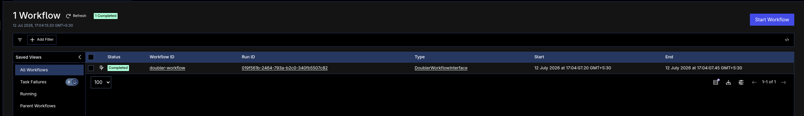
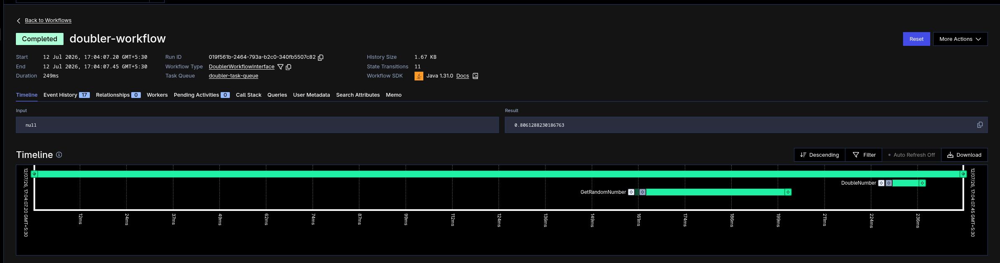

## Run

```bash
temporal server start-dev
```

In another terminal:

```bash
./gradlew :durable_execution:run
```

## Test

```bash
./gradlew :durable_execution:test
```

The tests use Temporal's local testing environment so the workflow runs with real activities.


