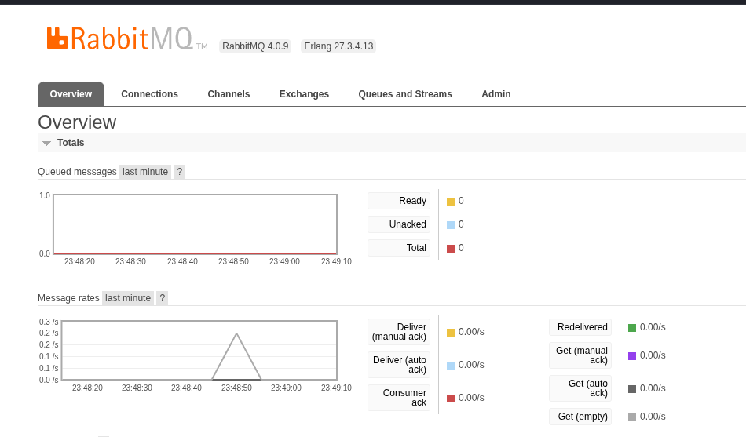
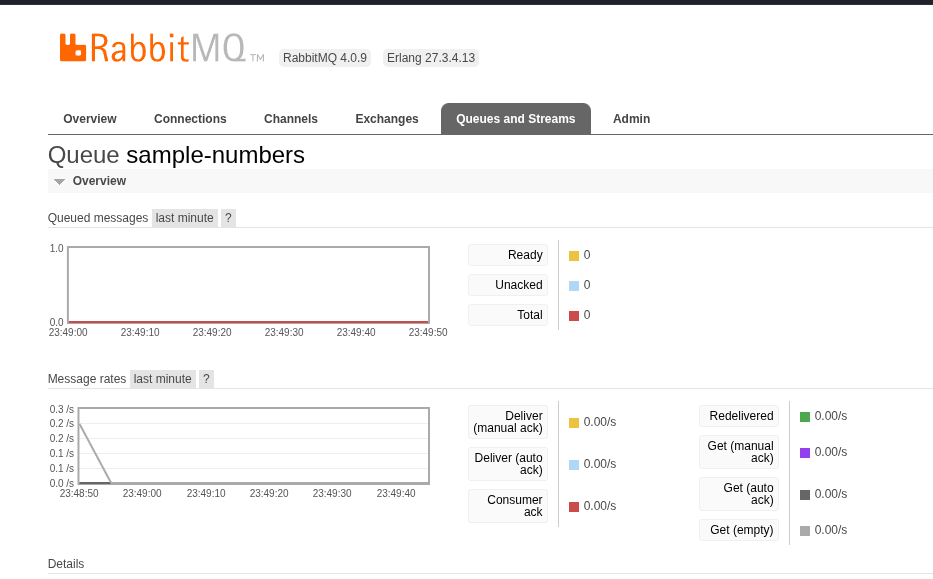

## Run the demo

Start RabbitMQ in one terminal:

```bash
podman run --rm --name some-rabbitmq \
  -p 5672:5672 \
  -p 15672:15672 \
  rabbitmq:4.0-management-alpine
```

In another terminal:

```bash
./gradlew :rabbitmq:run
```

The sample connects to RabbitMQ, sends five messages, doubles the numeric
ones, and writes malformed records to `rabbitmq/failed_messages.txt`.

## Run the tests

```bash
./gradlew :rabbitmq:test
```

## Inspect RabbitMQ

Open http://127.0.0.1:15672/ to use the management UI.

Username: `guest`

Password: `guest`



