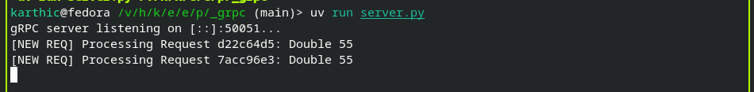
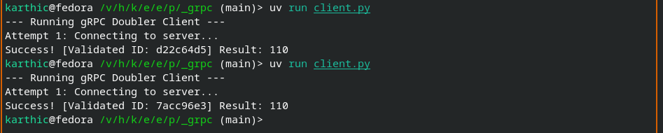

## Generate Proto Types & Stubs

```bash
uv run python -m grpc_tools.protoc -I. --python_out=. --grpc_python_out=. doubler_service.proto
```

If Pyright flags the generated gRPC files, add this line at the very top of the file:

```text
# pyright: reportAttributeAccessIssue=false
```

## Run Server

```bash
uv run python server.py
```



## Run Client

```bash
uv run python client.py
```

The client talks to `localhost:50051` by default. Use `--address` on the server or `--target` on the client to change it.


