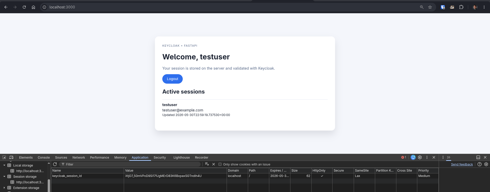
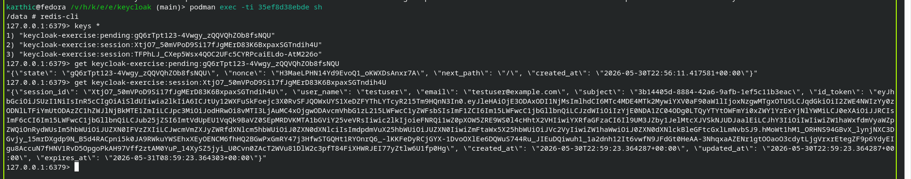

# Keycloak FastAPI exercise

This exercise builds a small server-side rendered FastAPI app that authenticates against the local Keycloak realm defined in `../keycloak/main.tf`.

Make sure that the Keycloak server is running as per instructions in `../keycloak/README.md`

## Run

Start Redis:

```bash
podman run --rm --name keycloak-redis -p 6379:6379 redis:7-alpine
```

In another terminal:

```bash
KEYCLOAK_BASE_URL=http://127.0.0.1:8080 \
KEYCLOAK_CLIENT_SECRET=... \
REDIS_URL=redis://localhost:6379/0 \
uv run uvicorn _keycloak.app:app --reload --host 127.0.0.1 --port 3000
```

## Test

```bash
uv run pytest -q _keycloak/test_app.py
```


