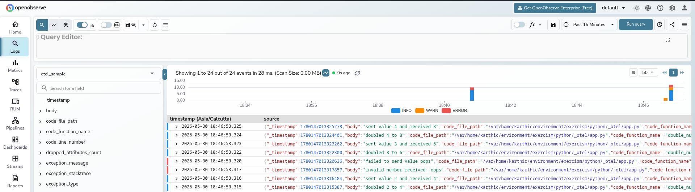
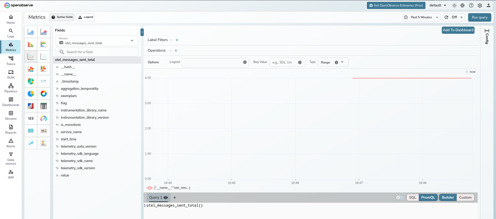
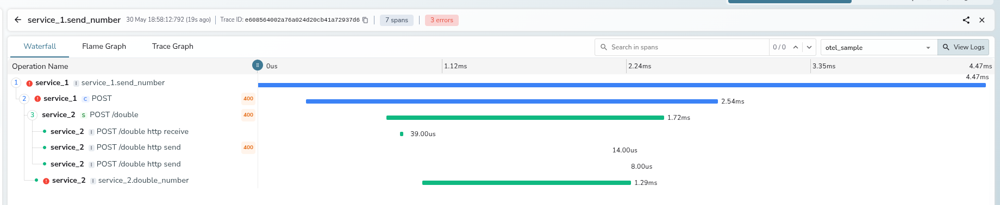

# OpenTelemetry sample

This sample shows manual OpenTelemetry traces, metrics, and logs in Python, plus
context propagation between two HTTP services.

## What it does

- `service_1` sends five messages to `service_2`
- `service_2` doubles numeric values and rejects one invalid message
- both services emit traces, metrics, and logs
- trace context is propagated with W3C headers

## Run OpenObserve locally

Use the OpenObserve self-hosted Docker option from the docs:

```bash
podman run --rm --name openobserve \
  -v $PWD/openobserve-data:/data \
  -e ZO_DATA_DIR="/data" \
  -e ZO_ROOT_USER_EMAIL="root@example.com" \
  -e ZO_ROOT_USER_PASSWORD="Complexpass#123" \
  -p 5080:5080 \
  -p 5081:5081 \
  public.ecr.aws/zinclabs/openobserve:latest
```

OpenObserve listens on `http://localhost:5080`.

## Run the OTLP gRPC collector

OpenObserve ingests OTLP data through a collector. Save this as
`collector.yaml`:

```yaml
receivers:
  otlp:
    protocols:
      grpc:
        endpoint: 0.0.0.0:4317

exporters:
  otlp_grpc/openobserve:
    endpoint: host.docker.internal:5081
    headers:
      Authorization: "Basic <base64(root@example.com:Complexpass#123)>"
      organization: default
      stream-name: otel-sample
    tls:
      insecure: true

service:
  pipelines:
    logs:
      receivers: [otlp]
      exporters: [otlp_grpc/openobserve]
    metrics:
      receivers: [otlp]
      exporters: [otlp_grpc/openobserve]
    traces:
      receivers: [otlp]
      exporters: [otlp_grpc/openobserve]
```

Then start the collector with your preferred image or binary and point the app
at it with `OTEL_EXPORTER_OTLP_ENDPOINT=127.0.0.1:4317`. The app itself only
needs the collector endpoint; the OpenObserve credentials stay in the collector
config.

```bash
podman run --rm \
  --add-host host.docker.internal:host-gateway \
  -p 4317:4317 \
  -v "$PWD/collector.yaml:/etc/otelcol-contrib/config.yaml" \
  otel/opentelemetry-collector-contrib:latest \
  --config /etc/otelcol-contrib/config.yaml
```

## Run the sample

Start `service_2`:

```bash
OTEL_EXPORTER_OTLP_ENDPOINT=127.0.0.1:4317 uv run python app.py --service service_2 --port 8002
```

In another terminal run the driver:

```bash
OTEL_EXPORTER_OTLP_ENDPOINT=127.0.0.1:4317 uv run python app.py --service service_1 --service-2-url http://127.0.0.1:8002
```

The driver sends `1`, `2`, `oops`, `3`, and `4`, then exits.

## Auto instrumentation

Install the OpenTelemetry distro plus the FastAPI, HTTPX, and logging
instrumentations, then run the same commands through `opentelemetry-instrument`:

```bash
OTEL_SERVICE_NAME=service_2 \
OTEL_RESOURCE_ATTRIBUTES=service.name=service_2 \
OTEL_EXPORTER_OTLP_ENDPOINT=127.0.0.1:4317 \
OTEL_EXPORTER_OTLP_PROTOCOL=grpc \
OTEL_EXPORTER_OTLP_INSECURE=true \
uv run opentelemetry-instrument python app.py --service service_2 --port 8002

OTEL_SERVICE_NAME=service_1 \
OTEL_RESOURCE_ATTRIBUTES=service.name=service_1 \
OTEL_EXPORTER_OTLP_ENDPOINT=127.0.0.1:4317 \
OTEL_EXPORTER_OTLP_PROTOCOL=grpc \
OTEL_EXPORTER_OTLP_INSECURE=true \
uv run opentelemetry-instrument python app.py --service service_1 --service-2-url http://127.0.0.1:8002
```

## Run the tests

```bash
uv run pytest -q _otel/test_app.py
```



