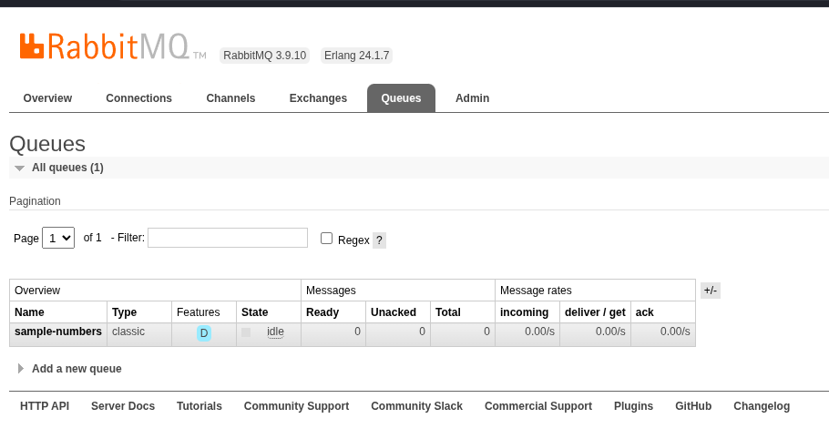
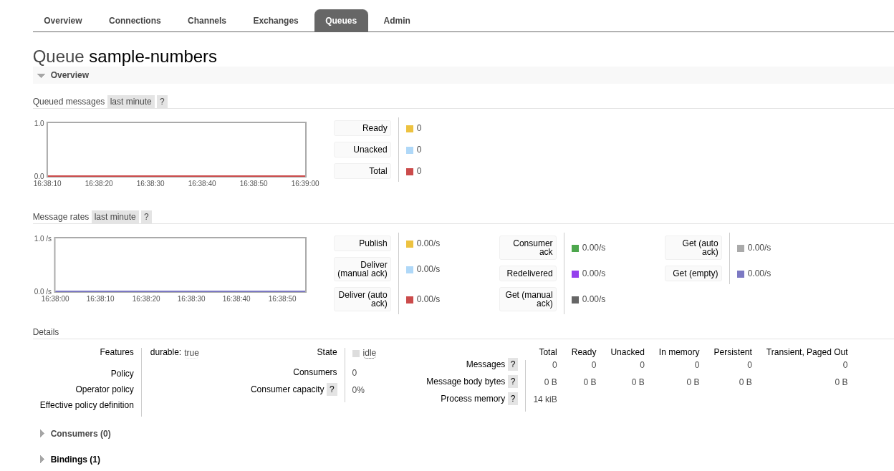

# RabbitMQ sample

## Run the demo

Start a RabbitMQ broker, for example:

```bash
podman run --rm --name some-rabbitmq \
  -p 5672:5672 \
  -p 15672:15672 \
  rabbitmq:3.9.10-management
```

Then, from this directory:

```bash
uv run python app.py --host localhost --port 5672
```

The sample connects to RabbitMQ, sends five messages, doubles the numeric ones, and writes malformed records to `failed_messages.txt`.

## Run the tests

```bash
uv run pytest -q test_app.py
```

## Inspect RabbitMQ

Open http://127.0.0.1:15672/ to use the management UI.

Username: `guest`

Password: `guest`



