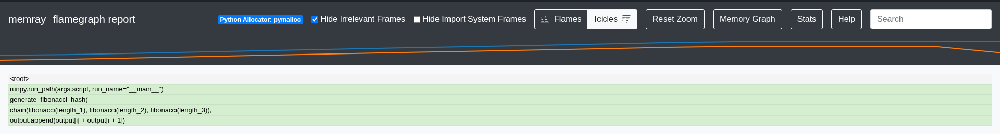
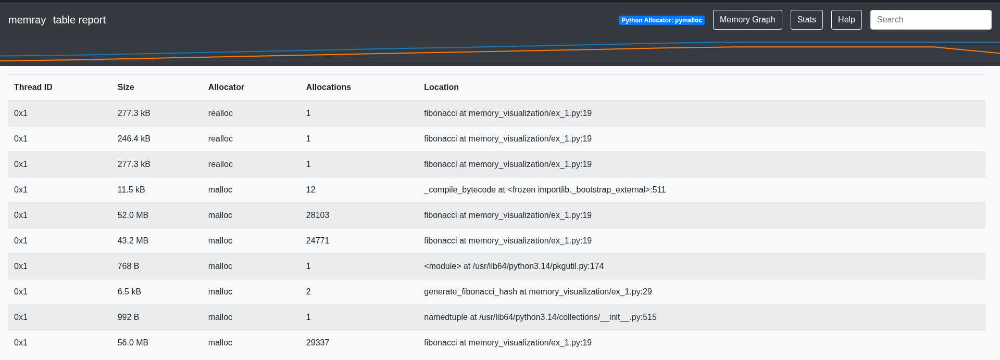
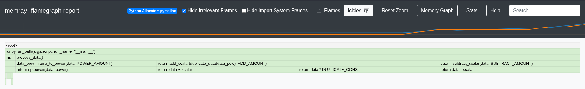
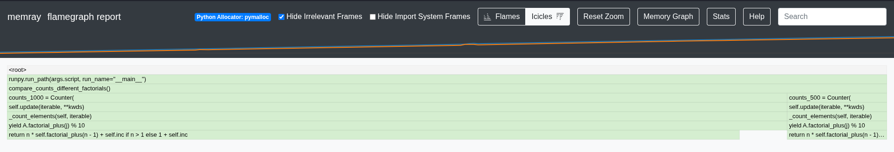
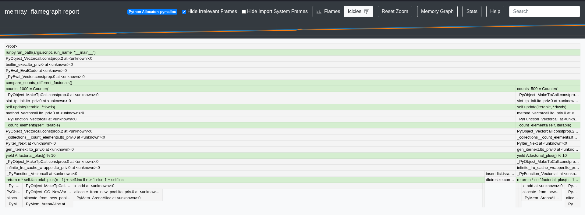
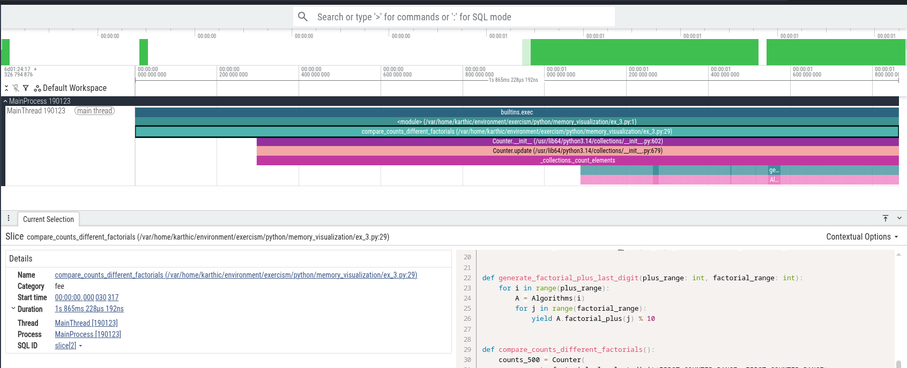

## Generate Flamegraph

```bash
uv run memray run <file>
```

Use the `--native` flag to see details on the native call stack leading to each allocation.

```bash
uv run memray run --native <file>
```

## Visualize Flamegraph


```bash
uv run memray flamegraph <generated bin file>
```

Open the generated html file in the browser

## Generate CPU Profile

```bash
uv run viztracer <file>
```

## Visualize CPU Profile

```
uv run vizviewer result.json
```

The command opens the result in the browser

## Exercises

### ex_1.py

Excessive memory consumption as the program stores all results in a local variable but only needs the result of the calculation.




### ex_2.py

Although Python automatically collects unused memory, in this case we have lingering references to data and data_pow that cause the program to hold onto memory for longer than needed. CPython may free objects promptly when their reference count drops to zero, but the process can keep memory for reuse instead of returning it immediately to the OS.



### ex_3.py

Unexpected memory consumption as the LRU cache object uses the object instance as part of the cache key.




