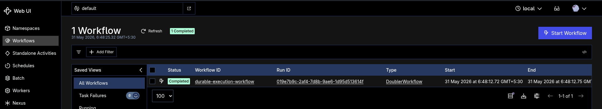
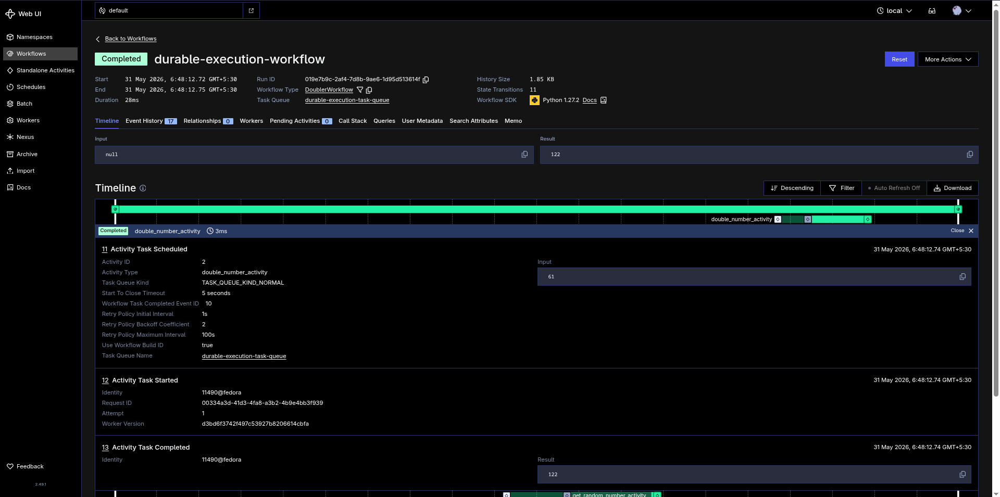

## Run

```bash
temporal server start-dev
```

In another terminal:

```bash
uv run python exercise.py
```

## Test

```bash
uv run pytest durable_execution/test_durable_execution.py
```

The tests use Temporal's local testing environment so the workflow runs with real activities.


