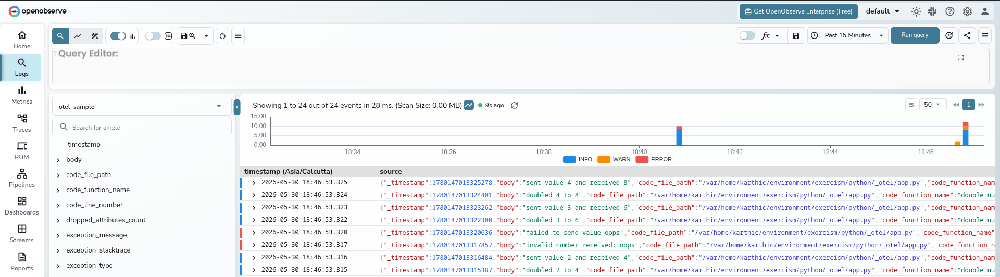
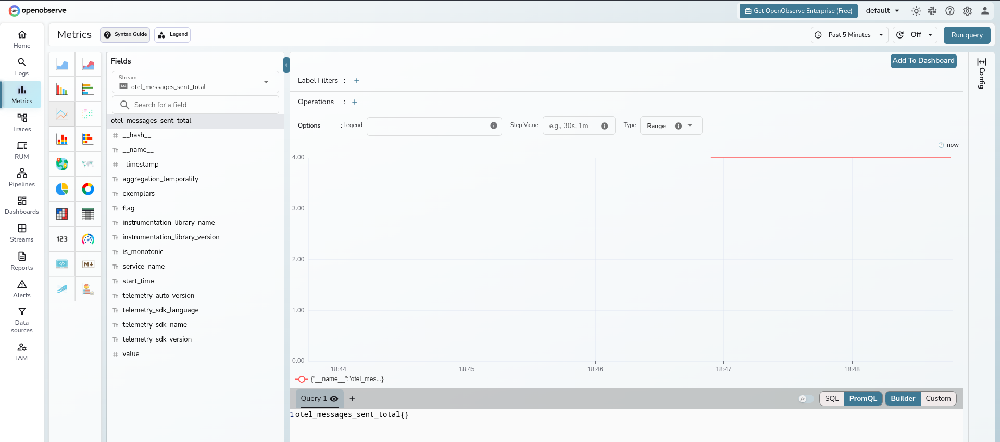
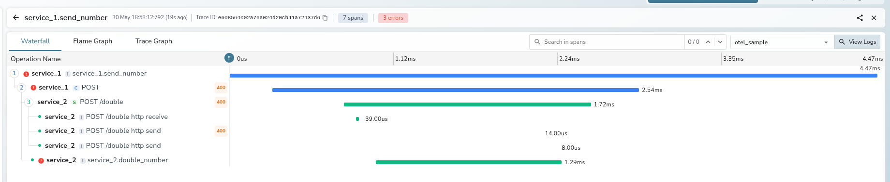

# OpenTelemetry sample

This sample shows manual OpenTelemetry traces, metrics, and logs in Python,
plus manual trace context propagation across a subprocess boundary.

## What it does

- `Service1` spawns `service_2_process.py` as a **subprocess** for each
  message and hands it trace context through `TRACEPARENT`/`TRACESTATE`
  environment variables
- `service_2_process.py` simulates an external integration with no OTel SDK
  of its own (e.g. a legacy script, another team's CLI, a queue worker
  written in a different stack) — it doubles numeric values and rejects one
  invalid message
- both processes emit traces, metrics, and logs, and the subprocess's span
  nests under the same trace as the caller's, even though nothing but an
  env var crossed the process boundary
- context is propagated with `opentelemetry.propagate.inject`/`extract` (the
  same API a real HTTP/gRPC client and server instrumentation library would
  call for you automatically); it's called by hand here only because there's
  no such library for "subprocess + env var" as a transport. In production,
  prefer an existing instrumentation (e.g.
  `opentelemetry-instrumentation-requests`, a gRPC client/server
  interceptor) over wiring this up yourself.

## Run OpenObserve locally

Use the OpenObserve self-hosted Docker option from the docs:

```bash
podman run --rm --name openobserve \
  -v $PWD/openobserve-data:/data \
  -e ZO_DATA_DIR="/data" \
  -e ZO_ROOT_USER_EMAIL="root@example.com" \
  -e ZO_ROOT_USER_PASSWORD="Complexpass#123" \
  -p 5080:5080 \
  -p 5081:5081 \
  public.ecr.aws/zinclabs/openobserve:latest
```

OpenObserve listens on `http://localhost:5080`.

## Run the OTLP gRPC collector

OpenObserve ingests OTLP data through a collector. Save this as
`collector.yaml`:

```yaml
receivers:
  otlp:
    protocols:
      grpc:
        endpoint: 0.0.0.0:4317

exporters:
  otlp_grpc/openobserve:
    endpoint: host.docker.internal:5081
    headers:
      Authorization: "Basic <base64(root@example.com:Complexpass#123)>"
      organization: default
      stream-name: otel-sample
    tls:
      insecure: true

service:
  pipelines:
    logs:
      receivers: [otlp]
      exporters: [otlp_grpc/openobserve]
    metrics:
      receivers: [otlp]
      exporters: [otlp_grpc/openobserve]
    traces:
      receivers: [otlp]
      exporters: [otlp_grpc/openobserve]
```

Then start the collector with your preferred image or binary and point the app
at it with `OTEL_EXPORTER_OTLP_ENDPOINT=127.0.0.1:4317`. The app itself only
needs the collector endpoint; the OpenObserve credentials stay in the collector
config.

```bash
podman run --rm \
  --add-host host.docker.internal:host-gateway \
  -p 4317:4317 \
  -v "$PWD/collector.yaml:/etc/otelcol-contrib/config.yaml" \
  otel/opentelemetry-collector-contrib:latest \
  --config /etc/otelcol-contrib/config.yaml
```

## Run the sample

```bash
OTEL_EXPORTER_OTLP_ENDPOINT=127.0.0.1:4317 \
uv run python app.py
```

`Service1` sends `1`, `2`, `oops`, `3`, and `4` to `Service2` by spawning
`service_2_process.py` as a subprocess once per message (`python -m
opentelemetry_exercise.service_2_process <value>`). Each process exports
telemetry with its own service name, so the trace graph shows both
`service_1` and `service_2`, nested under the same trace despite running in
separate OS processes.

## Manual context propagation across the subprocess boundary

`Service1._call_service_2` builds a carrier dict with
`opentelemetry.propagate.inject(carrier)`, then copies its
`traceparent`/`tracestate` values into the subprocess's environment as
`TRACEPARENT`/`TRACESTATE`. `service_2_process.py` reads those env vars back
into a carrier and calls `opentelemetry.propagate.extract(carrier)` to
recover a context holding the remote parent span, attaches it, and starts its
own span inside that context — so it nests under `Service1`'s trace.

This is exactly what OTel's HTTP/gRPC client and server instrumentation
libraries do for you automatically over the wire. Reach for those first; only
hand-roll `inject`/`extract` like this when propagating across a transport
with no existing instrumentation (here, "subprocess argv/env").

## Auto instrumentation

Install the `opentelemetry-distro` package plus the logging instrumentation,
then run the command through `opentelemetry-instrument`:

See the official guide: https://opentelemetry.io/docs/zero-code/python/

```bash
OTEL_EXPORTER_OTLP_ENDPOINT=127.0.0.1:4317 \
OTEL_EXPORTER_OTLP_PROTOCOL=grpc \
OTEL_EXPORTER_OTLP_INSECURE=true \
uv run opentelemetry-instrument python app.py
```

## Run the tests

```bash
uv run pytest -q opentelemetry_exercise/test_app.py
```




