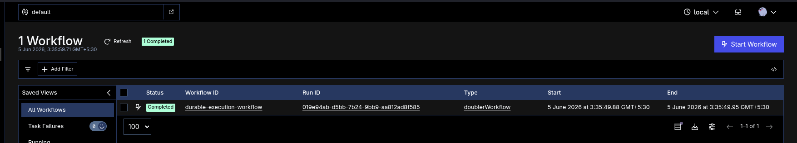
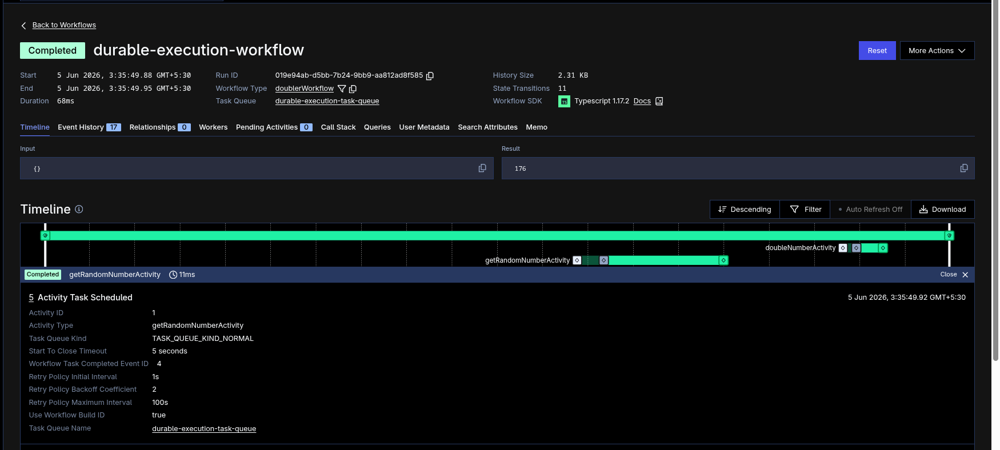

## Run

Start a local Temporal service in one terminal:

```bash
temporal server start-dev
```

In another terminal:

```bash
npx tsx durable_execution/worker.ts
npx tsx durable_execution/client.ts
```

## Test

```bash
npx vitest run durable_execution/durable_execution.test.ts
```

The test starts a local Temporal test environment and runs the workflow with real activities.



