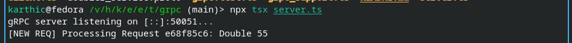

## Run Client and Server

This exercise uses `@grpc/grpc-js` and `@grpc/proto-loader`, so no generated
stub files are checked in. Generated TypeScript types live in `grpc/generated/`
locally and are ignored by git.

To regenerate them:

```bash
npx proto-loader-gen-types --keepCase --longs=String --enums=String --defaults --oneofs --grpcLib=@grpc/grpc-js --importFileExtension=.js --outDir grpc/generated grpc/doubler_service.proto
```

```bash
npx tsx grpc/server.ts
npx tsx grpc/client.ts
```

The server listens on `[::]:50051` by default. The client connects to
`localhost:50051` by default. Use `--address` on the server or `--target` on
the client to change it.



