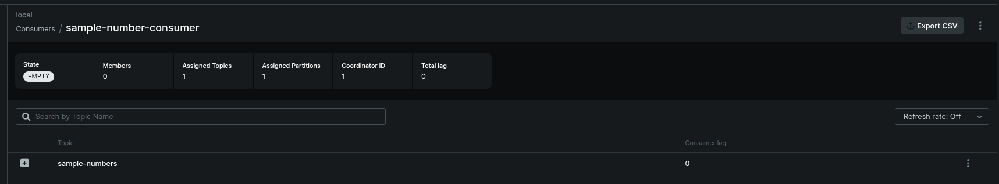
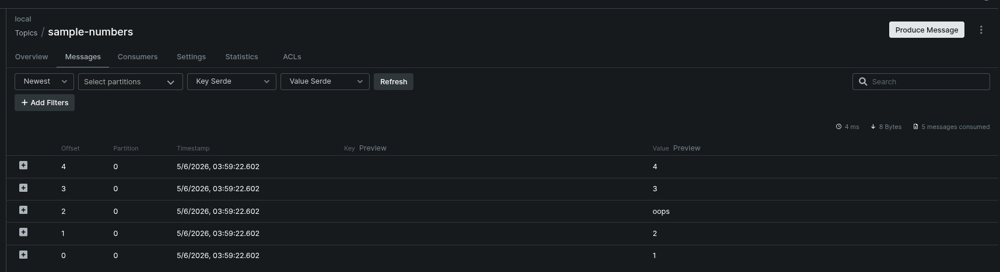

## Run the demo

Start Kafka in one terminal:

```bash
podman run --rm --name some-kafka \
  -p 9092:9092 \
  -p 9093:9093 \
  -p 9094:9094 \
  -e CLUSTER_ID=5L6g3nShT-eMCtK--X86sw \
  -e KAFKA_NODE_ID=1 \
  -e KAFKA_PROCESS_ROLES=broker,controller \
  -e KAFKA_CONTROLLER_QUORUM_VOTERS=1@localhost:9094 \
  -e KAFKA_CONTROLLER_LISTENER_NAMES=CONTROLLER \
  -e KAFKA_INTER_BROKER_LISTENER_NAME=HOST \
  -e KAFKA_LISTENER_SECURITY_PROTOCOL_MAP=HOST:PLAINTEXT,DOCKER:PLAINTEXT,CONTROLLER:PLAINTEXT \
  -e KAFKA_LISTENERS=HOST://0.0.0.0:9092,DOCKER://0.0.0.0:9093,CONTROLLER://0.0.0.0:9094 \
  -e KAFKA_ADVERTISED_LISTENERS=HOST://localhost:9092,DOCKER://host.docker.internal:9093 \
  -e KAFKA_OFFSETS_TOPIC_REPLICATION_FACTOR=1 \
  -e KAFKA_TRANSACTION_STATE_LOG_REPLICATION_FACTOR=1 \
  -e KAFKA_TRANSACTION_STATE_LOG_MIN_ISR=1 \
  apache/kafka:latest
```

In another terminal:

```bash
npx tsx kafka/app.ts
```

The sample connects to a Kafka broker you provide, sends five messages, doubles the
numeric ones, and writes malformed records to `failed_messages.txt`.

## Run the tests

```bash
npx vitest run kafka/test_app.test.ts
```

## Run Kafbat UI

From another terminal:

```bash
podman run --rm -it --name some-kafbat-ui -p 8080:8080 \
  --add-host=host.docker.internal:host-gateway \
  -e DYNAMIC_CONFIG_ENABLED=true \
  -e KAFKA_CLUSTERS_0_NAME=local \
  -e KAFKA_CLUSTERS_0_BOOTSTRAPSERVERS=host.docker.internal:9093 \
  ghcr.io/kafbat/kafka-ui:latest
```

Open http://localhost:8080 to inspect the `local` cluster.



