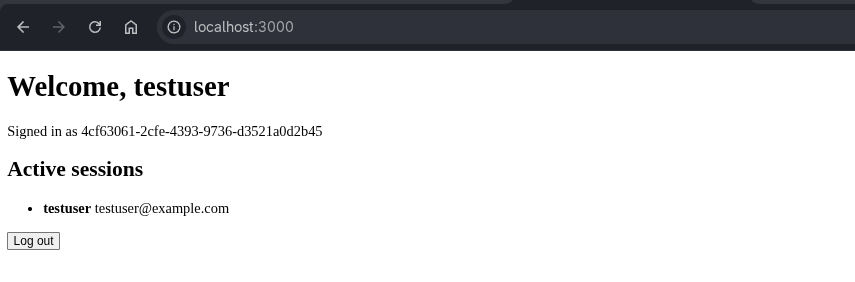
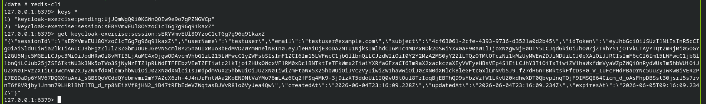

# Keycloak Express exercise

This exercise builds a small server-side rendered Express app that authenticates against a local Keycloak realm and stores sessions in Redis.

Make sure that the Keycloak server is running as per instructions in `../../keycloak/README.md`

## Run

Start Redis:

```bash
podman run --rm --name keycloak-redis -p 6379:6379 redis:7-alpine
```

Then run the app:

```bash
KEYCLOAK_BASE_URL=http://127.0.0.1:8080 \
KEYCLOAK_CLIENT_SECRET=... \
REDIS_URL=redis://localhost:6379/0 \
npx tsx keycloak/app.ts
```

## Test

```bash
npx vitest run keycloak/test_app.test.ts
```



