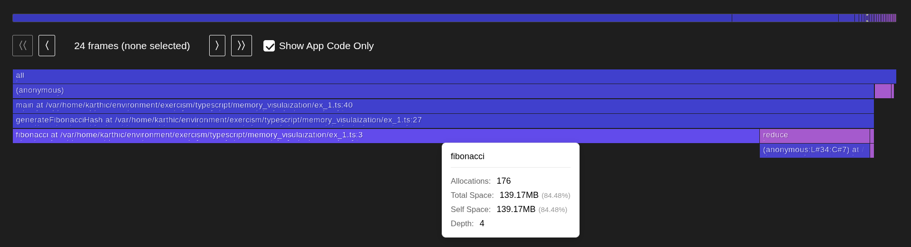
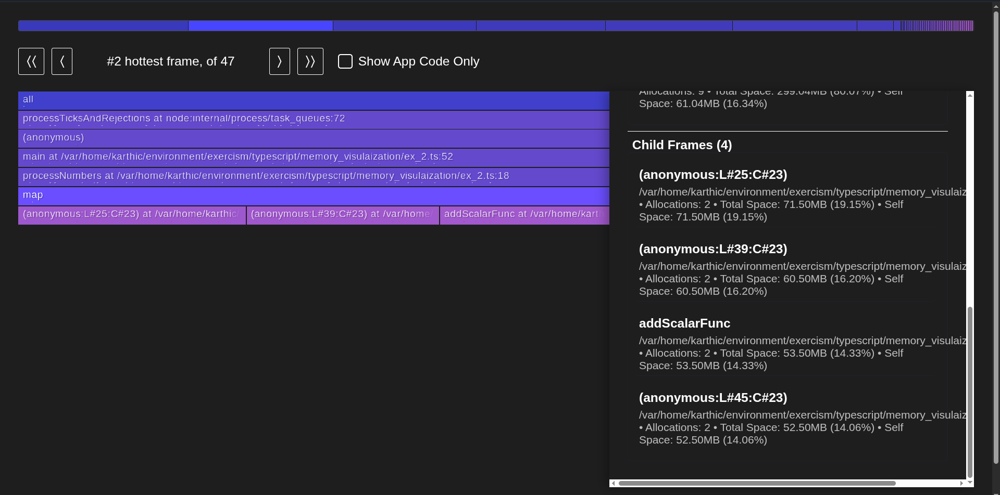
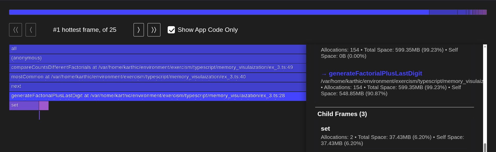

## Compile TypeScript

```bash
npx tsc
```

## Generate Profile

```bash
npx flame run --sourcemap-dirs=dist dist/memory_visulaization/<file>.js
```

Open the generated html file in the browser

## Exercises

### ex_1.ts

Excessive memory consumption as the program stores all results in a local variable but only needs the result of the calculation.



### ex_2.ts

Although Node.js automatically collects unsued memory, in this case we have lingering references to data and data_pow that cause the program to hold onto memory for longer than needed.



### ex_3.ts

Unexpected memory consumption as the LRU cache object uses the object instance as part of the cache key.


