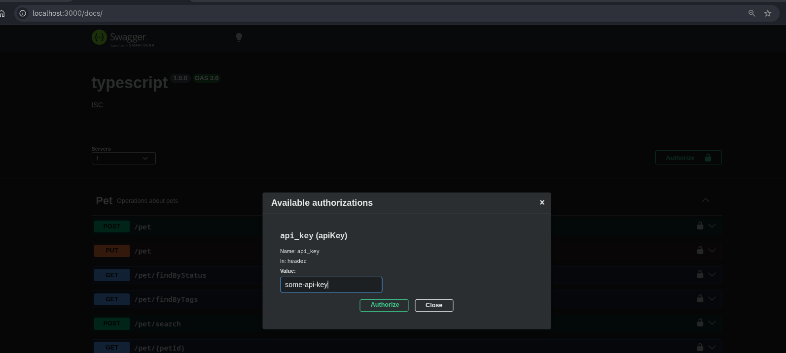
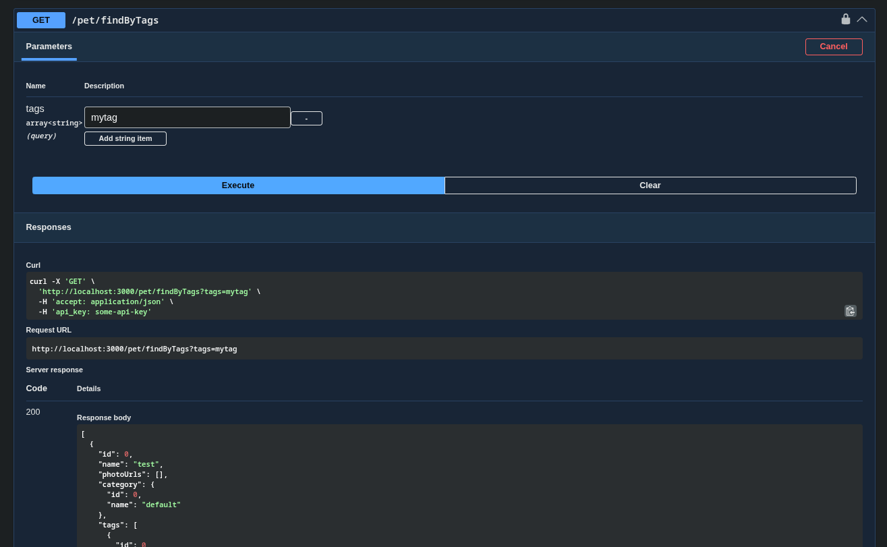

## Generate tsoa routes and OpenAPI spec

From `typescript/`:

```bash
npm run tsoa:spec
npm run tsoa:routes
```

## Generate the OpenAPI client

From `typescript/`:

```bash
npx openapi-ts -f openapi/openapi-ts.config.ts
```

## Run the server

```bash
npx tsx openapi/server.ts
```

## Run the client driver

Start the server first, then from `typescript/`:

```bash
npx tsx openapi/client_driver.ts
```

## Run the tests

```bash
npm run test:openapi
```

## OpenAPI docs

The generated specification is written to `openapi/build/swagger.json`.
Requests use the `api_key` header with the value `some-api-key`.
Swagger UI is available at `/swagger` (also `/docs` and `/openapi`).

The generated client is written to `openapi/api-client/` and the driver
uses it to call the local server with the generated `api_key` auth header.



